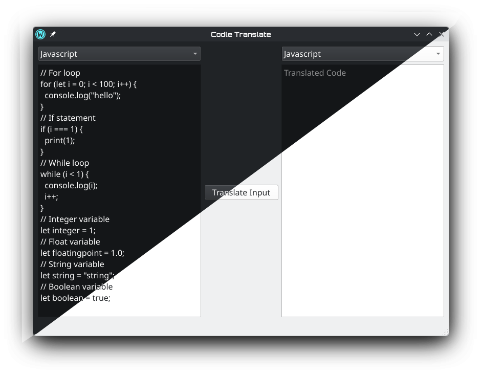
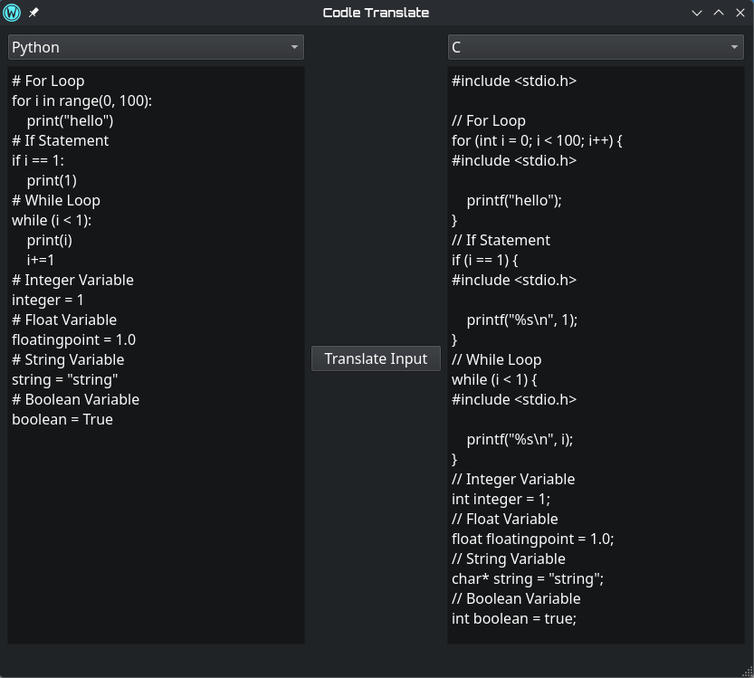

# Codle Translate

A lightweight desktop app for translating code between programming languages.



---

## Supported Code

**Supported Languages:**

- JavaScript
- Python
- Java
- C

**Supported constructs:**

- Variable declarations (int, float, string, bool)
- for loops (range() and C-style)
- while loops
- if statements
- Output statements
- Single-line comments

---

## Installation Guide

> **IMPORTANT**
> Python **3.13.x** is required for this project.

The project can be installed automatically from the install script (`.bat` for Windows and `.sh` for Linux) or the project can be manually installed with the following instructions.

Install [Poetry](https://python-poetry.org/) if not installed already installation instructions can be found here:
https://python-poetry.org/docs/#installing-with-the-official-installer

> **Poetry installation note:**
> If the poetry command is not recognized, add poetry to the PATH

Then install dependencies and launch the GUI:

```bash
poetry  install
poetry run gui
```



## Testing

Run all tests with verbose output:

```bash
poetry run test
```

Run a specific test class:

```bash
poetry run pytest tests/test.py::ClassName -v
```

Run a specific test:

```bash
pytest tests/test.py::ClassName::test_method -v
```

---

## Dependencies

| Package                                                                          | Purpose                     |
| -------------------------------------------------------------------------------- | --------------------------- |
| [PySide6](https://pypi.org/project/PySide6/)                                     | Desktop GUI framework (Qt6) |
| [tree-sitter-language-pack](https://pypi.org/project/tree-sitter-language-pack/) | Multi-language parsing      |
| [pytest](https://pypi.org/project/pytest/)                                       | Unit Testing                |

---

## Limitations

The translator handles common patterns but is not a full compiler and as such complex constructs like functions, classes, imports, and multi-line expressions are not currently supported.

---

## License

MIT
